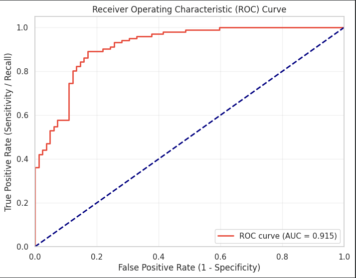
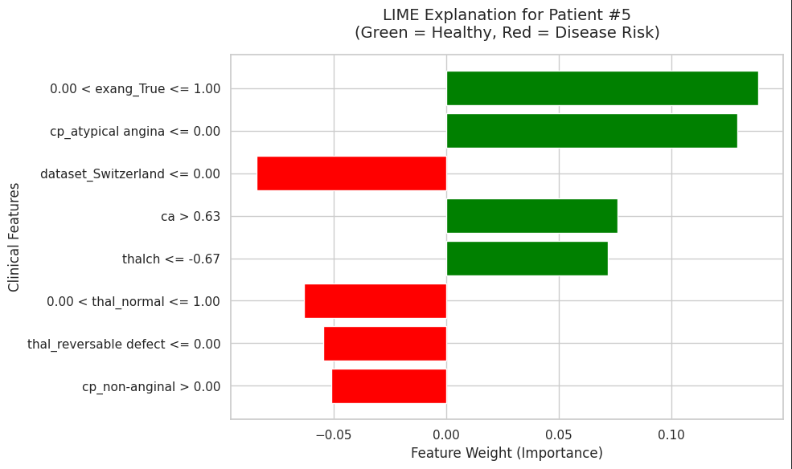

#  Explainable AI for Heart Disease Prediction using LIME

An end-to-end Machine Learning research project that not only predicts the presence of heart disease using clinical data but also opens the "Black Box" of the model to explain *why* a specific diagnosis was made using **Local Interpretable Model-agnostic Explanations (LIME)**.

## The Goal: Solving the "Black Box" Problem
Modern Machine Learning models like Random Forests are highly accurate, but they act as "Black Boxes." If a model predicts a patient has an 85% chance of heart disease, a doctor needs to know the clinical reasons behind that number before making medical decisions. 

This project builds a robust predictive model and utilizes LIME to provide clear, human-readable explanations for every individual prediction.

## How LIME Works (The "Tug-of-War" Analogy)
To understand the model's decisions, LIME acts like a referee in a game of clinical tug-of-war for a single patient:
* **The Players:** Every clinical feature (Age, Cholesterol, Chest Pain type) is a player pulling on the rope.
* **The Direction:** Some features pull toward a "Healthy" diagnosis, while others pull toward "Heart Disease".
* **The Strength:** LIME calculates exactly how hard each feature is pulling. By measuring the length and direction of these "pulls," we can see precisely which symptoms drove the model's final diagnosis.

## Project Pipeline
This repository contains a complete data science pipeline, detailed in the accompanying Colab notebook:
1. **Exploratory Data Analysis (EDA):** Visualizing feature distributions and relationships within the UCI Heart Disease dataset.
2. **Advanced Preprocessing:** Handling missing medical data using KNN Imputation and scaling numerical features for optimal model performance.
3. **Model Building:** Training a `RandomForestClassifier` optimized for medical diagnosis (prioritizing Recall and ROC-AUC).
4. **Explainability (XAI):** Deploying `lime-tabular` to generate visual explanations for individual patient predictions.

## Model Performance
The Random Forest classifier achieved strong predictive performance on the unseen test data:
* **Accuracy:** 85.33%
* **ROC-AUC Score:** 0.915

## Visualizing the Explanations
Below is an example of a LIME explanation generated by this project. 
* **Red Bars (Right):** Clinical features increasing the risk of heart disease.
* **Green Bars (Left):** Clinical features indicating a healthy patient.

## Technologies Used
* **Language:** Python
* **Data Processing:** Pandas, NumPy, Scikit-Learn
* **Machine Learning:** Random Forest (Scikit-Learn)
* **Explainable AI:** LIME (`lime` library)
* **Visualization:** Matplotlib, Seaborn

## How to Run this Project
1. Clone the repository: `git clone https://github.com/Hansaka2001/Explainable-AI-Heart-Disease-LIME.git`
2. Open the `Heart_Disease_Prediction_and_Explanation.ipynb` file in Google Colab or Jupyter Notebook.
3. Ensure the `heart_disease_uci.csv` dataset is in the same directory.
4. Run all cells sequentially!